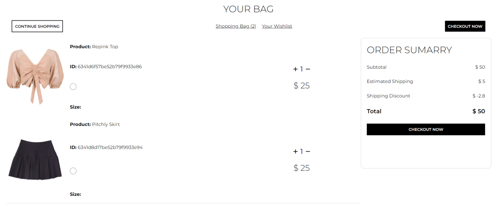
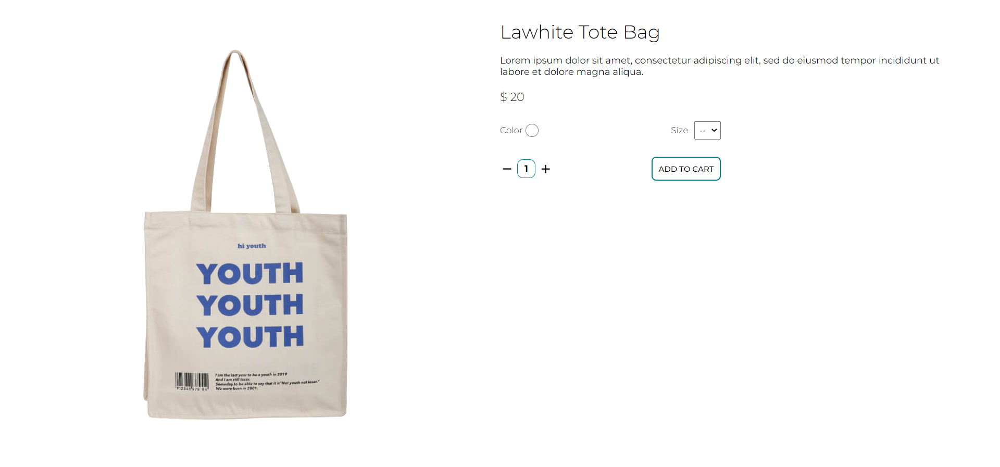

# Lune | E-Commerce Website
Lune is a fully responsive e-commerce website, built using MERN stack.

## Features

- Register or login as an existing user.
- Applying filters to search products.
- Adding products to the shopping cart.
- Changing the required amount of for products.
- Checking order summary.

## Technologies Used

- React.js.
- Redux.
- Styled-Components.
- Node.js
- Express.js.
- MongoDB.
- REST API.

## Screenshots 

 
**Shopping Cart**

**Single Product Page**

